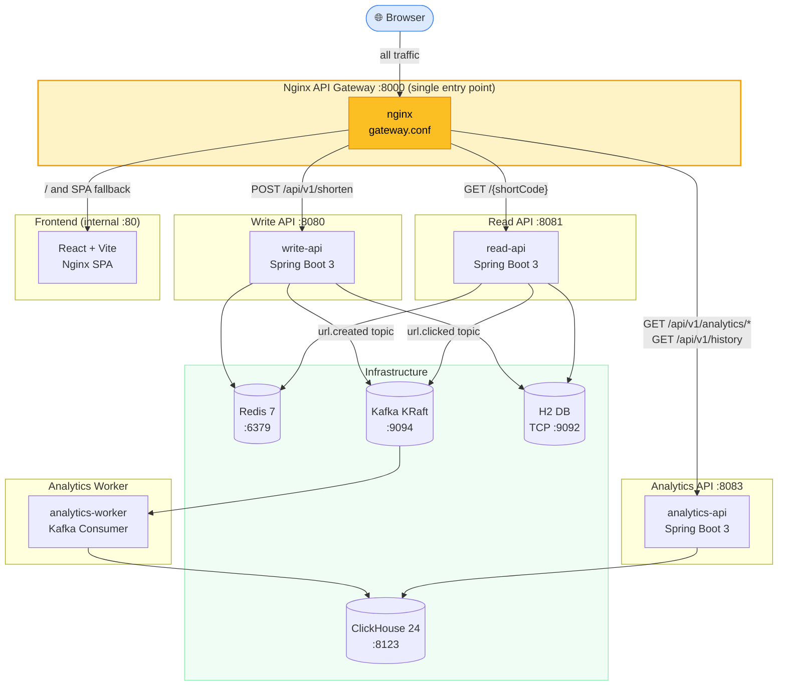
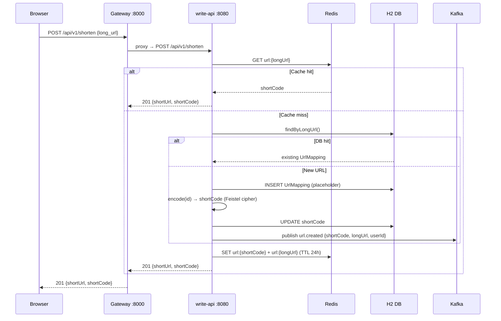
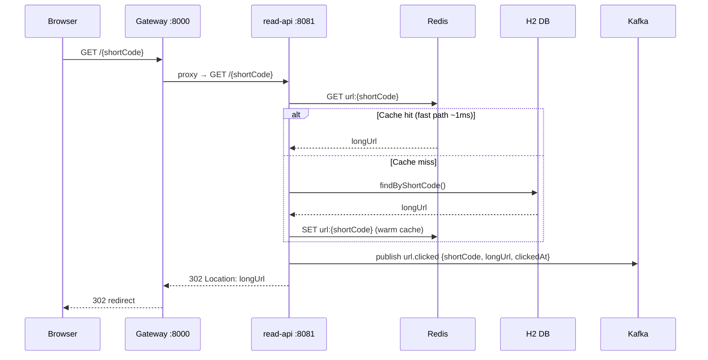
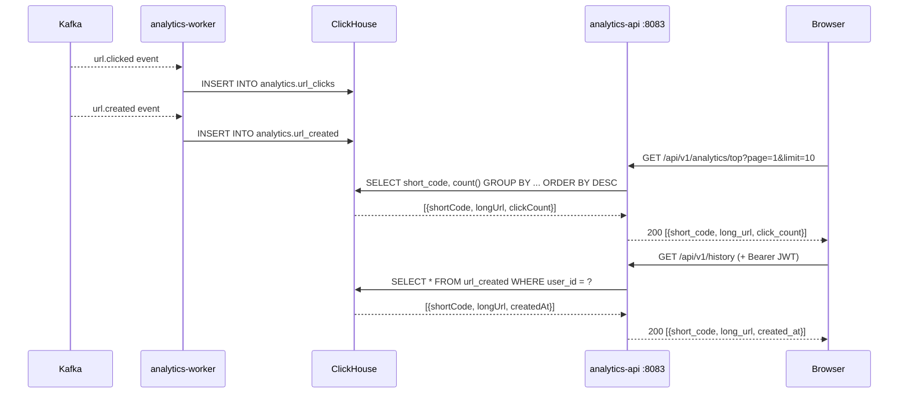
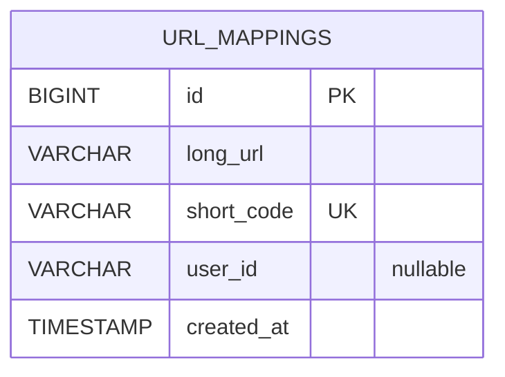
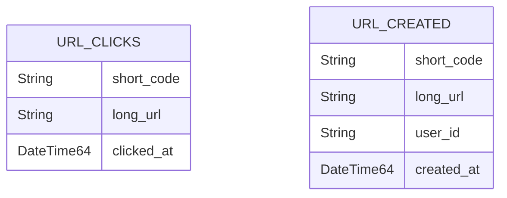

# Architecture

## System Overview

HyperShort is a URL shortener built with a polyglot microservices architecture. The Java backend replaces the original Go services while keeping the same frontend and infrastructure stack.

---

## Phase 4 — Full Architecture (current)



---

## Request Flow Diagrams

### Shorten a URL



### Redirect a Short URL



### Analytics Pipeline



---

## Short Code Generation — Feistel Cipher

Short codes are derived deterministically from the auto-incremented DB row ID using a 32-bit Feistel cipher, then base62-encoded.

```
DB ID (Long)  →  Feistel(id, rounds=4)  →  base62 encode  →  shortCode (6-8 chars)
     1        →        2891336763        →    "4jTh9q"
     2        →         892341029        →    "aB3xKp"
```

**Why Feistel instead of random?**
- Deterministic — same ID always produces same code
- No collision risk — bijective mapping
- Unpredictable — sequential IDs produce non-sequential codes (no enumeration attacks)
- No extra DB column needed to store a separate random value

---

## Data Models

### H2 (write-api / read-api)



### ClickHouse (analytics)



---

## Gateway Routing Table

| Method | Path | Upstream | Auth |
|--------|------|----------|------|
| `POST` | `/api/v1/shorten` | write-api:8080 | Optional (Google JWT) |
| `GET` | `/api/v1/analytics/top` | analytics-api:8083 | None (public) |
| `GET` | `/api/v1/history` | analytics-api:8083 | Required (Google JWT) |
| `GET` | `/{shortCode}` | read-api:8081 | None |
| `GET` | `/`, `/my-links`, `/*` | frontend:80 (SPA) | None |

> **Fallback strategy**: The gateway tries read-api for all `/{path}` requests. If read-api returns 404 (unknown short code or SPA route), Nginx silently serves the React SPA — no double round-trip visible to the browser.
