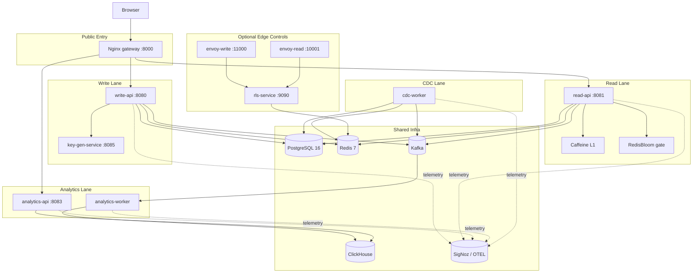
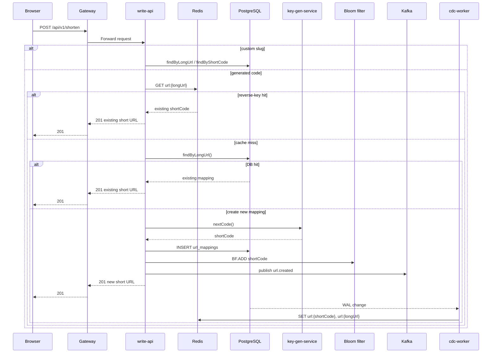
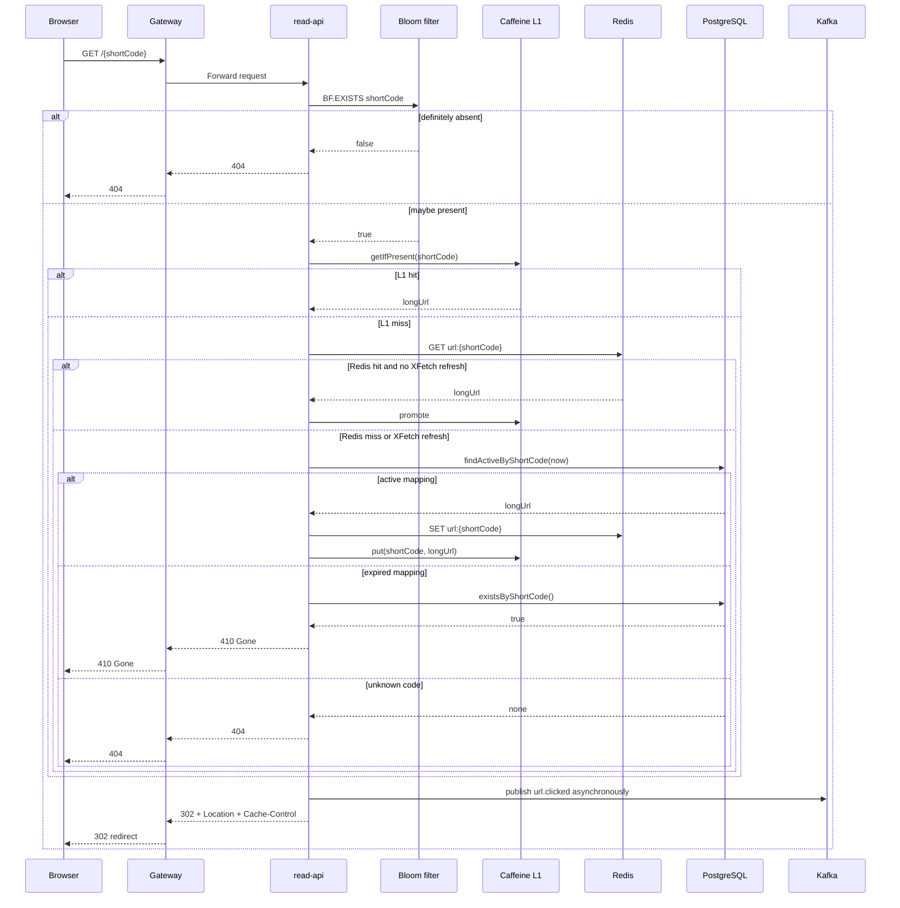
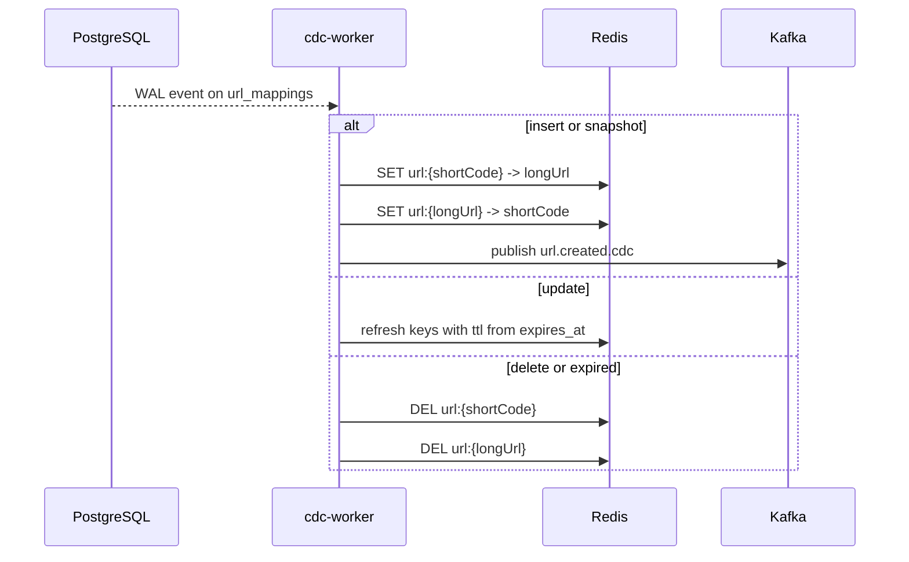
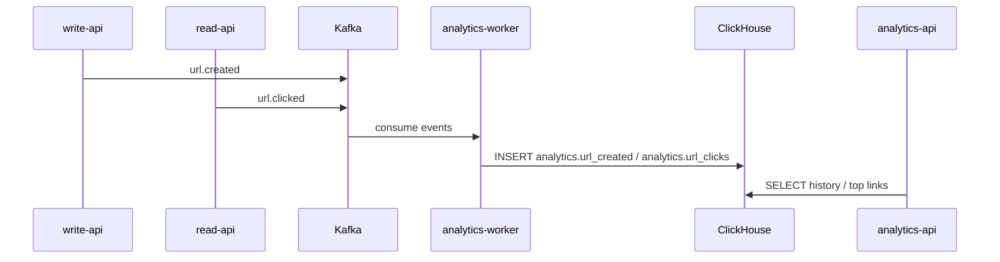
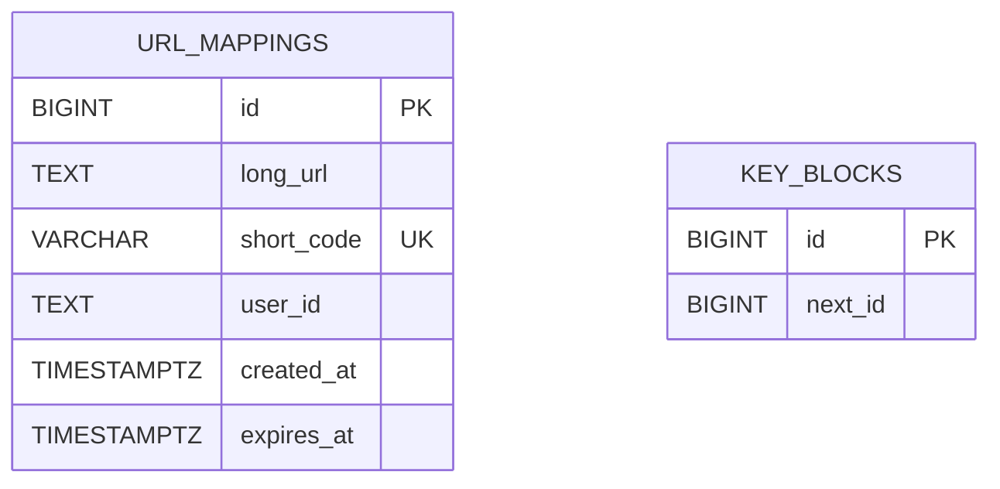
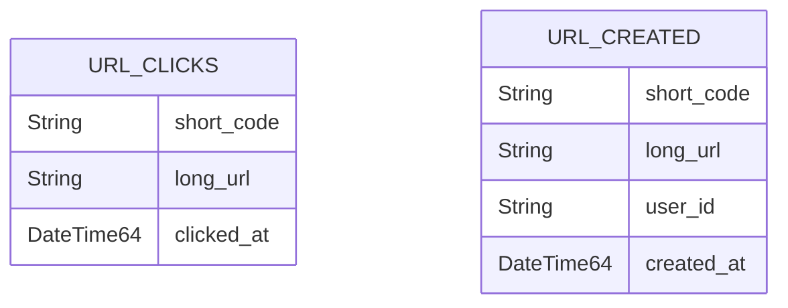

# Architecture

## System Overview

HyperShort splits the platform into four practical lanes:

- **write lane**: create or reuse a short URL
- **read lane**: resolve a short code with minimal latency
- **cdc lane**: keep Redis aligned with PostgreSQL truth
- **analytics lane**: keep dashboard queries away from the transactional store

## Request Flows

### Shorten a URL

**Why this flow matters**:

- dedupe prefers Redis reverse keys first
- new short codes are created without inline Redis warming
- `BF.ADD` happens immediately so the read path does not false-404 during CDC lag

### Redirect a Short URL

### CDC Cache Maintenance

### Analytics Flow

## Data Models

### PostgreSQL

### ClickHouse

## Gateway Routing Table

| Method | Path | Upstream | Auth |
|---|---|---|---|
| `POST` | `/api/v1/shorten` | `write-api:8080` | Optional Google JWT |
| `GET` | `/{shortCode}` | `read-api:8081` | None |
| `GET` | `/api/v1/analytics/top` | `analytics-api:8083` | None |
| `GET` | `/api/v1/history` | `analytics-api:8083` | Required Google JWT |
| `GET` | `/` | frontend SPA | None |
