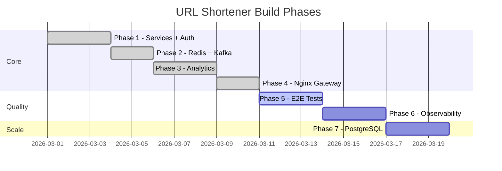

# Build Phases

This project is built incrementally. Each phase is a standalone commit that leaves the system in a fully working state.

---

## Phase 1 — Core Services ✅

**Goal**: Working URL shortener end-to-end with auth.

**What was built**:
- `write-api` (Spring Boot, port 8080)
  - `POST /api/v1/shorten` — accepts `{long_url}`, returns `{short_url, short_code}`
  - Feistel cipher for short code generation (no collisions, unpredictable)
  - H2 in-memory DB with TCP server mode (so read-api can share it)
  - Google OAuth2 JWT validation via Spring Security
  - Spring Actuator health endpoint
- `read-api` (Spring Boot, port 8081)
  - `GET /{shortCode}` — 302 redirect
  - Connects to write-api's H2 TCP server
- Frontend from original repo (React 19 + Vite + Tailwind)
- Dockerfiles for both services
- `docker-compose.yml` (write-api + read-api + frontend)

**Stack**: Java 17, Spring Boot 3.2, H2, Gradle multi-module

---

## Phase 2 — Caching + Events ✅

**Goal**: Redis cache-aside for fast redirects; Kafka for async analytics pipeline.

**What was built**:
- Redis 7 added to docker-compose
- Kafka (KRaft, no Zookeeper) added to docker-compose
- `write-api`: Redis cache check before DB; caches both `url:{shortCode}→longUrl` and `url:{longUrl}→shortCode`; publishes `url.created` to Kafka
- `read-api`: Redis cache-aside on every redirect; warms cache on DB miss; publishes `url.clicked` to Kafka (fail-open — won't block redirect)
- `UrlCreatedEvent` and `UrlClickedEvent` Kafka payload classes

**Performance improvement**: Redirects go from ~5ms (DB) to ~1ms (Redis cache hit).

---

## Phase 3 — Analytics ✅

**Goal**: Real-time click analytics stored in ClickHouse, queryable via REST.

**What was built**:
- ClickHouse 24 added to docker-compose
- `analytics-worker` (new Spring Boot module)
  - Kafka consumer for `url.clicked` → `INSERT INTO analytics.url_clicks`
  - Kafka consumer for `url.created` → `INSERT INTO analytics.url_created`
  - Schema auto-bootstrapped on startup (idempotent `CREATE TABLE IF NOT EXISTS`)
- `analytics-api` (new Spring Boot module, port 8083)
  - `GET /api/v1/analytics/top?page=1&limit=10` — public leaderboard
  - `GET /api/v1/history` — authenticated user's link history
  - Raw JDBC queries against ClickHouse
- `userId` added to `UrlMapping` entity and `UrlCreatedEvent` (nullable for anonymous)
- JWT subject extracted in controller, threaded through to entity + event

**Data flow**: click → Kafka → analytics-worker → ClickHouse → analytics-api → frontend table

---

## Phase 4 — Nginx API Gateway ✅

**Goal**: Single entry point. Eliminate multi-port confusion. Fix SPA deep links.

**What was built**:
- `nginx/gateway.conf` — routes all traffic through port 8000:
  - `POST /api/v1/shorten` → write-api
  - `GET /api/v1/analytics/*` + `GET /api/v1/history` → analytics-api
  - `GET /{shortCode}` → read-api (with `proxy_intercept_errors` fallback to SPA)
  - `GET /` → frontend
- `nginx/Dockerfile` — `nginx:stable-alpine` gateway image
- `frontend/nginx.conf` — `try_files $uri /index.html` SPA routing (was commented out)
- `frontend/Dockerfile` — enables the SPA nginx config
- `docker-compose.yml` — gateway service on port 8000; frontend no longer exposed externally
- `frontend/vite.config.js` — dev proxy mirrors gateway routing for native dev

**User-visible change**: Everything is now at `http://localhost:8000`. No more port juggling.

---

## Phase 5 — End-to-End Testing 🔜

**Goal**: Playwright + Spring integration tests that run against the real gateway and verify the full stack.

**Planned**:
- Playwright tests (TypeScript) against `http://localhost:8000`
  - Shorten a URL, verify response shape
  - Follow redirect, verify destination
  - Check analytics table updates after redirect
  - Verify `/my-links` auth gate
- Spring `@SpringBootTest` integration tests for write-api and read-api
- `test.sh` script that spins up Docker Compose, runs all tests, tears down

---

## Phase 6 — Observability 🔜

**Goal**: Structured logging, metrics, and traces without SigNoz complexity.

**Planned**:
- Structured JSON logging (Logback + logstash-logback-encoder) in all services
- Micrometer metrics exposed via Actuator (`/actuator/metrics`, `/actuator/prometheus`)
- Request tracing headers (`X-Request-Id`) threaded through gateway → services
- Prometheus scrape config in docker-compose
- Grafana dashboard (URL creation rate, redirect p99, cache hit ratio, Kafka lag)

---

## Phase 7 — Persistent Storage 🔜

**Goal**: Replace H2 (in-memory, resets on restart) with PostgreSQL.

**Planned**:
- PostgreSQL 16 added to docker-compose
- Flyway migrations for schema management
- Connection pool tuning (HikariCP)
- H2 kept for unit tests (`@DataJpaTest`)
- read-api gets its own read replica connection (or same DB, read-only user)

---

## Roadmap Summary

